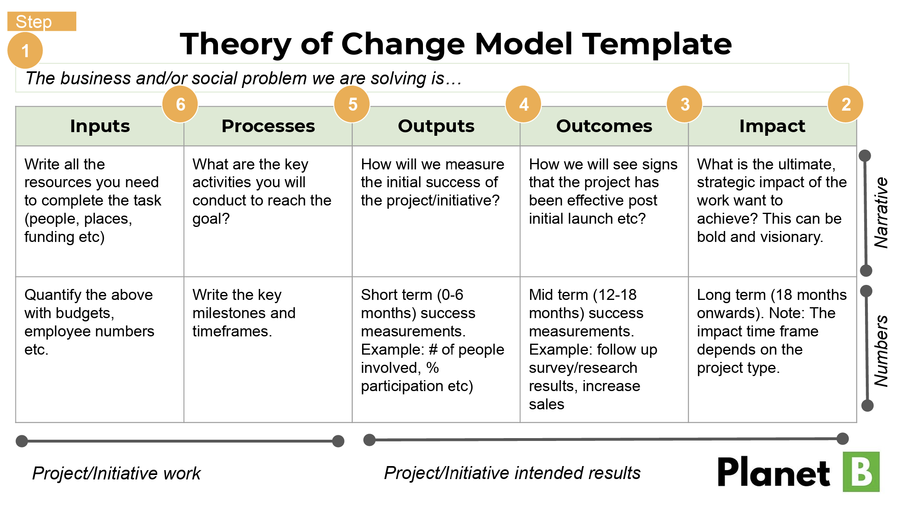

# Chapter 1: Foundations of AI-Driven Social Good Projects

## Unit 2: Management of Social Good Projects

### Block 1

Welcome to Unit 2, where we delve into the fundamental principles of **project management for social good initiatives**. This unit will equip you with essential knowledge about the project lifecycle, stakeholder management, and the systematic approach needed to transform social problems into actionable project solutions.

Project management in the social good sector requires a unique blend of traditional project management methodologies with deep understanding of community needs, cultural sensitivities, and sustainable development principles. By the end of this unit, you will understand how to operationalize social needs, problems, and opportunities through structured project approaches.

### Block 2

## The Project Lifecycle: From Concept to Impact

The **project lifecycle** represents the systematic progression of activities from initial idea conception to final project closure and impact evaluation. For social good projects, this lifecycle is particularly crucial as it ensures sustainable outcomes and meaningful community engagement.

### Five Phases of Project Management

*Source: project-management.com*

**1. Project Initiation Phase**
- Define project vision and social problem to be addressed
- Conduct feasibility studies and community needs assessments
- Develop project charter and secure initial stakeholder commitment
- Identify key stakeholders and establish project governance structure

**2. Project Planning Phase**
- Create detailed project management plan with timelines and milestones
- Develop work breakdown structure (WBS) and resource allocation plans
- Establish risk management framework and contingency plans
- Design monitoring and evaluation framework with impact indicators

**3. Project Execution Phase**
- Implement planned activities and deliver project outputs
- Coordinate team activities and manage stakeholder engagement
- Ensure quality control and adherence to social good principles
- Facilitate community participation and capacity building

**4. Project Monitoring and Control Phase**
- Track progress against planned objectives and success metrics
- Monitor risks and implement corrective actions as needed
- Evaluate ongoing impact and make necessary adjustments
- Maintain transparent communication with all stakeholders

**5. Project Closure Phase**
- Complete final deliverables and conduct impact evaluation
- Document lessons learned and best practices
- Ensure sustainable handover to local communities or institutions
- Celebrate achievements and recognize contributions

### Block 3

## From Problem to Project: The Theory of Change

The **Theory of Change** is a comprehensive methodology for planning, participation, and evaluation that maps out the steps needed to achieve long-term goals. For social good projects, it serves as a roadmap connecting activities to desired social outcomes.

### Components of Theory of Change

**Problem Analysis**
- Root cause analysis of social issues
- Stakeholder mapping and needs assessment
- Context analysis including cultural, political, and economic factors
- Identification of barriers and opportunities for change

**Vision and Long-term Goals**
- Clear articulation of desired social change
- Alignment with UN Sustainable Development Goals
- Community-validated outcomes and impact statements
- Time-bound and measurable objectives

**Pathways of Change**
- Logical sequence of interventions and activities
- Identification of assumptions and external factors
- Risk assessment and mitigation strategies
- Resource requirements and capacity needs

**Indicators and Evidence**
- Quantitative and qualitative measurement frameworks
- Baseline data collection and monitoring systems
- Learning and adaptation mechanisms
- Impact evaluation and reporting protocols

*Source: Planet B Insights*

### Theory of Change Example: Digital Literacy Project in Rural India

**Long-term Goal**: Improve economic opportunities for rural women through digital literacy

**Intermediate Outcomes**:
- Women can access and use digital financial services
- Women can participate in online marketplaces for their products
- Women can access government services digitally

**Activities**:
- Mobile training centers with culturally appropriate curriculum
- Peer-to-peer learning networks
- Partnerships with local banks and service providers
- Digital device lending programs

### Block 4

## Stakeholder Management in Social Good Projects

**Stakeholders** are individuals, groups, or organizations that can affect or are affected by a project. In social good projects, stakeholder management is particularly complex due to the diverse interests, power dynamics, and cultural considerations involved.

### Types of Stakeholders

**Primary Stakeholders**
- **Direct beneficiaries**: Communities and individuals who will directly receive project benefits
- **Local partners**: Community-based organizations, local NGOs, and grassroots groups
- **Implementation team**: Project staff, volunteers, and technical experts
- **Funding organizations**: Donors, grant-making institutions, and impact investors

**Secondary Stakeholders**
- **Government agencies**: Local, regional, and national government departments
- **Academic institutions**: Universities, research centers, and educational organizations
- **Private sector**: Local businesses, suppliers, and potential scaling partners
- **Civil society**: Advocacy groups, religious organizations, and cultural institutions

**Key Stakeholders**
- **Community leaders**: Traditional authorities, elected officials, and influential individuals
- **Technical experts**: Subject matter specialists and advisory committees
- **Media and communications**: Journalists, bloggers, and social media influencers
- **International organizations**: UN agencies, bilateral donors, and global networks

### Stakeholder Analysis Framework

| Stakeholder Group | Interest Level | Influence Level | Engagement Strategy |
|------------------|----------------|-----------------|-------------------|
| Direct Beneficiaries | High | Medium | Collaborate & Empower |
| Local Government | Medium | High | Consult & Inform |
| Funding Organizations | High | High | Partner & Report |
| Community Leaders | High | High | Collaborate & Consult |
| Technical Experts | Medium | Medium | Consult & Inform |
| Private Sector | Low | Medium | Inform & Monitor |

### Block 5

## Roles and Functions in Social Good Projects

Successful social good projects require clearly defined roles and responsibilities that respect both professional expertise and community knowledge. The following structure balances technical competence with community participation:

### Core Project Team Roles

**Project Manager**
- Overall project coordination and strategic leadership
- Stakeholder relationship management and communication
- Risk management and problem-solving
- Budget management and resource allocation
- **Key Skills**: Cross-cultural communication, adaptive leadership, systems thinking

**Community Engagement Coordinator**
- Liaison between project team and local communities
- Facilitation of community participation and consultation
- Cultural interpretation and sensitivity guidance
- Local capacity building and empowerment activities
- **Key Skills**: Cultural competency, facilitation, local language proficiency

**Technical Specialists**
- Subject matter expertise in relevant technical areas
- Design and implementation of technical interventions
- Quality assurance and standards compliance
- Knowledge transfer and capacity building
- **Key Skills**: Technical expertise, training abilities, adaptability

**Monitoring and Evaluation Specialist**
- Design and implementation of M&E frameworks
- Data collection, analysis, and reporting
- Learning and adaptation facilitation
- Impact assessment and evaluation
- **Key Skills**: Research methods, data analysis, evaluation design

### Community-Based Roles

**Community Champions**
- Local advocacy and project promotion
- Peer-to-peer education and support
- Feedback collection and community representation
- Sustainability planning and local ownership
- **Selection Criteria**: Community respect, communication skills, commitment

**Local Advisory Committee**
- Strategic guidance and cultural oversight
- Conflict resolution and mediation
- Resource mobilization and sustainability planning
- Quality assurance from community perspective
- **Composition**: Community leaders, beneficiary representatives, technical experts

### Block 6

## Project Management in the Indian Context

India's diverse social landscape requires adapted project management approaches that account for linguistic diversity, cultural variations, and complex governance structures. The country's experience with large-scale social programs provides valuable insights for AI-driven initiatives.

### Successful Social Good Projects in India

**Aadhaar Digital Identity System**
- **Scale**: Over 1.3 billion enrolled citizens
- **Innovation**: Biometric authentication and digital identity verification
- **Impact**: Enhanced access to government services and financial inclusion
- **Lessons**: Importance of privacy considerations and gradual rollout strategies

**Key Learning Points:**
• Systematic approach to enrollment and verification processes
• Integration with existing government service delivery systems
• Privacy and data protection frameworks
• Community education and awareness campaigns

**Self-Help Group (SHG) Movement**
- **Scale**: Over 70 million women participating in 6.2 million groups
- **Innovation**: Community-based microfinance and skill development
- **Impact**: Women's empowerment and rural economic development
- **Lessons**: Power of peer learning and social collateral

**Key Learning Points:**
• Community ownership and self-governance models
• Gradual capacity building and leadership development
• Integration of financial and social services
• Peer learning and knowledge sharing systems

### Cultural Considerations for Project Management

**Hierarchy and Authority**
- Respect for age, experience, and traditional leadership
- Formal approval processes and consensus building
- Integration of traditional and modern governance structures

**Communication Patterns**
- Indirect communication styles and face-saving considerations
- Importance of relationship building before task execution
- Multi-language communication strategies

**Time and Process Orientation**
- Flexible timeline approaches accounting for festivals and seasons
- Iterative decision-making and consultation processes
- Balance between efficiency and relationship maintenance

### Block 7

## AI Tools for Project Management

Modern project management increasingly leverages artificial intelligence tools to enhance efficiency, improve decision-making, and optimize resource allocation. For social good projects, these tools must be implemented thoughtfully to complement rather than replace human-centered approaches.

### AI-Powered Project Planning Tools

**ChatGPT and Generative AI for Project Scoping**
- **Applications**: 
  - Generate project charters and scope statements
  - Create work breakdown structures and task lists
  - Develop risk registers and mitigation strategies
  - Draft stakeholder communication plans

- **Best Practices**:
  - Use AI-generated content as starting points requiring human review
  - Incorporate local context and cultural considerations manually
  - Validate AI suggestions against community needs and preferences
  - Ensure transparency in AI-assisted decision-making processes

**Notion AI for Documentation and Collaboration**
- **Applications**:
  - Automated meeting notes and action item tracking
  - Project documentation templates and frameworks
  - Progress reporting and status updates
  - Knowledge management and information organization

- **Implementation Tips**:
  - Train team members on AI tool usage and limitations
  - Establish clear protocols for AI-generated content review
  - Maintain human oversight for sensitive or strategic decisions
  - Create feedback loops for continuous improvement

### Stakeholder Mapping with Digital Tools

**Lucidchart for Visual Stakeholder Analysis**
- Interactive stakeholder mapping and relationship visualization
- Power-interest grids and influence networks
- Collaboration features for team-based analysis
- Integration with project management platforms

**Theory of Change Digital Platforms**
- Online tools for collaborative theory of change development
- Logic model creation and pathway visualization
- Outcome tracking and indicator monitoring
- Stakeholder validation and feedback collection

### Block 8

## Key Learning Points

• **The project lifecycle provides a systematic framework for transforming social problems into actionable solutions**

• **Theory of Change methodology helps connect project activities to desired social outcomes through logical pathways**

• **Stakeholder management in social good projects requires careful attention to power dynamics, cultural considerations, and community participation**

• **Project roles must balance technical expertise with community knowledge and cultural competency**

• **Regional context significantly influences project management approaches and success factors**

• **AI tools can enhance project management efficiency but must complement rather than replace human-centered approaches**

• **Successful social good projects require adaptive management approaches that respond to changing community needs and contexts**

• **Sustainability planning and community ownership are critical from project initiation through closure**

---

## Case Study: Jan Aushadhi - India's Generic Medicine Program

**Background:**
The Jan Aushadhi scheme was launched by the Government of India to provide quality generic medicines at affordable prices to citizens, particularly targeting rural and underserved populations who often lack access to essential medications.

**Project Structure:**
- **Initiation (2008)**: Identified healthcare access gap for essential medicines
- **Planning (2010-2012)**: Developed franchise model with quality assurance systems
- **Execution (2013-present)**: Established over 9,000+ outlets across India
- **Monitoring**: Continuous quality control and impact assessment
- **Scaling**: Expansion targets of 10,500 stores by 2025

**Stakeholder Ecosystem:**
- **Primary Beneficiaries**: Rural and low-income populations needing affordable medicines
- **Implementation Partners**: State governments, NGOs, and private entrepreneurs
- **Government Agencies**: Ministry of Chemicals & Fertilizers, state health departments
- **Supply Chain**: Pharmaceutical companies, distributors, and quality control laboratories
- **Community**: Local doctors, healthcare workers, and patient associations

**Project Management Innovations:**
- **Digital Supply Chain**: Real-time inventory management and demand forecasting
- **Quality Assurance**: Centralized testing and certification systems
- **Training Programs**: Standardized training for store operators and pharmacists
- **Impact Monitoring**: Regular surveys and feedback collection systems

**Results and Impact:**
- Over 1,500 essential medicines available at 50-90% lower prices
- Estimated savings of ₹5,000+ crores for patients
- Improved access to quality healthcare in rural areas
- Created employment opportunities for over 15,000 people

**Tasks for Analysis:**
1. **Stakeholder Mapping**: Create a comprehensive stakeholder analysis matrix
2. **Theory of Change**: Develop a logic model showing how activities lead to health outcomes
3. **Risk Assessment**: Identify potential risks and mitigation strategies
4. **AI Integration**: Propose AI applications for supply chain and quality management

**Keywords for Understanding:**
- Healthcare access, supply chain management, franchise model, quality assurance, government partnerships, social entrepreneurship, digital health, impact scaling

---

## Assessment: Mini-Case Project Design

**Scenario:**
You have been appointed as project manager for a new initiative to improve maternal health outcomes in rural Bangladesh using AI-powered diagnostic tools. The project aims to reduce maternal mortality rates by enabling early detection of pregnancy complications through mobile health screening units.

**Context for Analysis:**
- Target areas have limited road access and unreliable electricity
- Local healthcare workers have basic training but limited advanced diagnostic experience
- Cultural norms require involving family members in healthcare decisions
- Government health system is supportive but has limited resources
- Previous technology projects have had mixed adoption rates

**Project Planning Requirements:**
1. Develop a theory of change connecting activities to maternal health outcomes
2. Create a stakeholder analysis matrix identifying all relevant actors
3. Design a project timeline with key milestones and decision points
4. Propose AI applications that are appropriate for the local context
5. Identify potential risks and mitigation strategies

**Questions for Analysis:**
1. How would you adapt the standard project lifecycle for this cultural context?
2. What role should community health workers play in the project governance?
3. How would you ensure sustainable operation of AI diagnostic tools?
4. What partnerships would be essential for project success?

**Evaluation Criteria:**
- Understanding of project management principles
- Cultural sensitivity and stakeholder engagement
- Realistic assessment of technical and resource constraints
- Creative problem-solving for sustainability challenges
- Integration of community participation with technical innovation

---

## Quiz: Management of Social Good Projects

1. **Which phase of the project lifecycle involves conducting feasibility studies and community needs assessments?**
   a) Planning
   b) Execution
   c) Initiation
   d) Monitoring and Control

2. **A Theory of Change primarily helps project managers to:**
   a) Calculate project budgets accurately
   b) Map logical connections between activities and desired outcomes
   c) Assign team roles and responsibilities
   d) Schedule project milestones

3. **In stakeholder analysis, which stakeholder category typically requires a "Collaborate & Empower" engagement strategy?**
   a) Government agencies with low interest but high influence
   b) Technical experts with medium interest and influence
   c) Direct beneficiaries with high interest but medium influence
   d) Private sector with low interest and medium influence

4. **True or False: AI tools should completely replace human decision-making in social good project management.**

5. **Which of the following is NOT a typical role in social good project teams?**
   a) Community Engagement Coordinator
   b) Monitoring and Evaluation Specialist
   c) Profit Maximization Manager
   d) Technical Specialist

**Answer Key:**
1. c) Initiation
2. b) Map logical connections between activities and desired outcomes
3. c) Direct beneficiaries with high interest but medium influence
4. False
5. c) Profit Maximization Manager

---

## References

Atlassian. (2024). *Project life cycle: The 5 phases explained*. Retrieved from https://www.atlassian.com/work-management/project-management/project-life-cycle

Kerzner, H. (2017). *Project management: A systems approach to planning, scheduling, and controlling* (12th ed.). John Wiley & Sons.

Project Management Institute. (2021). *A guide to the project management body of knowledge (PMBOK guide)* (7th ed.). PMI Publications.

Theory of Change Community. (2024). *What is theory of change?* Retrieved from https://www.theoryofchange.org/what-is-theory-of-change/

UNDP. (2019). *Technology for social good in India*. World Bank Feature Story. Retrieved from https://www.worldbank.org/en/news/feature/2019/05/10/how-technology-is-being-used-for-social-good-in-india

Weiss, C. H. (1995). Nothing as practical as good theory: Exploring theory-based evaluation for comprehensive community initiatives for children and families. In J. P. Connell, A. C. Kubisch, L. B. Schorr, & C. H. Weiss (Eds.), *New approaches to evaluating community initiatives* (pp. 65-92). Aspen Institute.