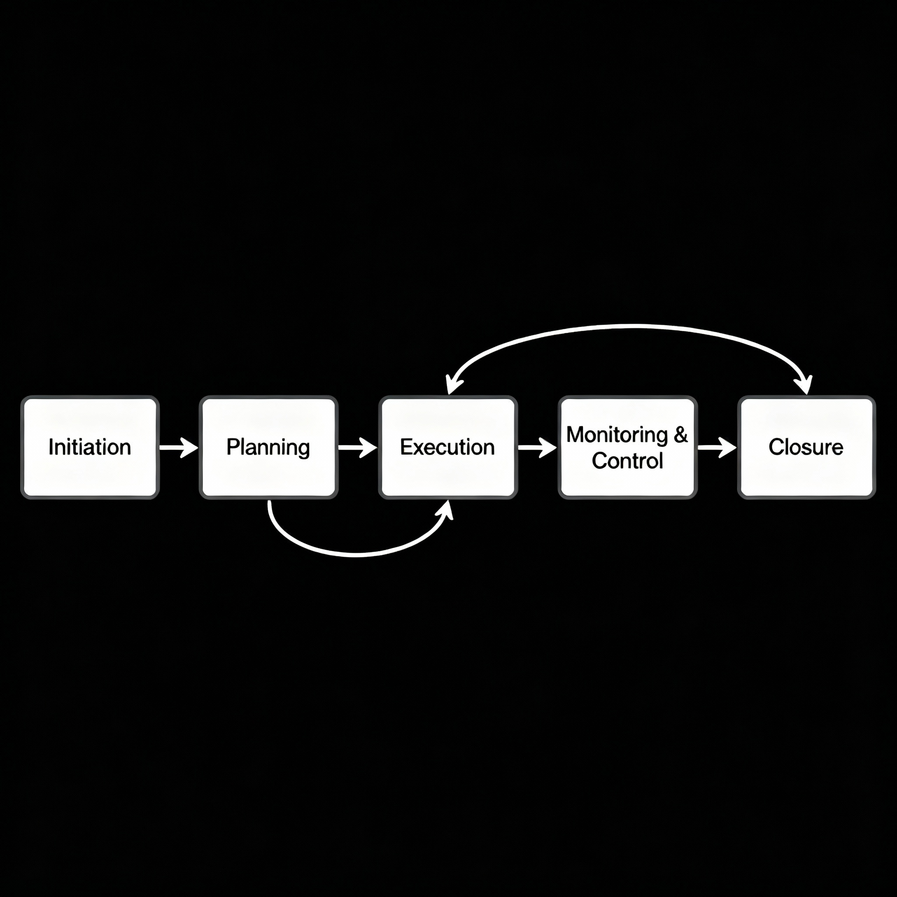
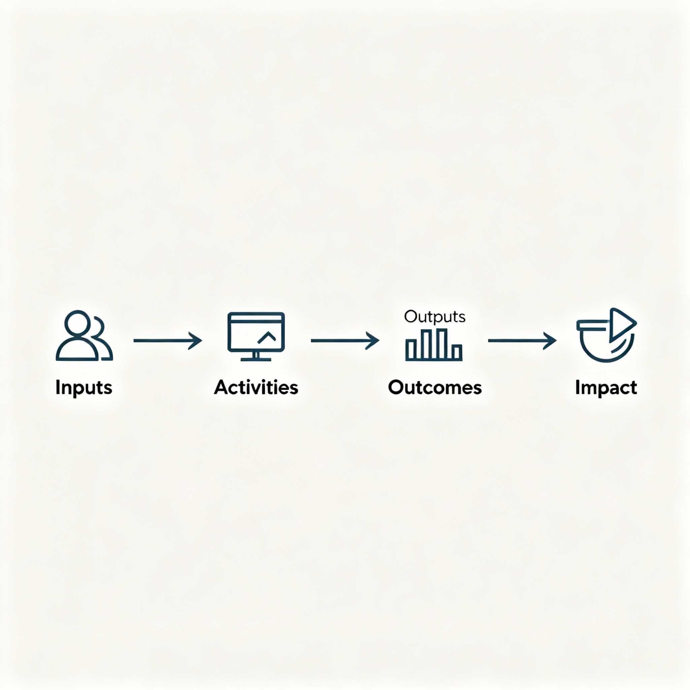

# Chapter 1 – Understanding and Connecting the Dots: Introduction to Social Good, AI, and Projects

## Unit 2: Management of Social Good Projects

### Block 1

Welcome to Unit 2, where we explore **project management fundamentals for social good initiatives** in simple, practical terms. This unit will help you understand how to turn social problems into organized projects that create real change in communities.

Managing social good projects is both an art and a science. It requires balancing systematic planning with flexibility, professional standards with cultural sensitivity, and efficient processes with meaningful community engagement. By the end of this unit, you will understand the essential steps for managing projects that create lasting positive change.

## Understanding the Project Journey: From Idea to Impact
### Block 2

**Every successful social good project** follows a similar journey, like building a house or planning a wedding. There are essential steps that ensure success, and understanding this journey helps you manage projects more effectively.

### The Five Phases of Project Management
### Block 3

**1. Project Initiation: "Getting Started Right"**

This is where you move from "We should do something about this problem" to "Here's exactly what we're going to do":

- **Understand the Problem**: Talk to communities to understand what they really need
- **Check Feasibility**: Make sure your idea is realistic and doable
- **Get Buy-In**: Ensure key people and organizations support your project
- **Define Success**: Be clear about what success looks like

*Example*: Before starting a women's literacy program, spend time in the community understanding why women aren't currently attending school, what obstacles exist, and what approaches might work.

**2. Project Planning: "Mapping Your Route"**

This is where you figure out exactly how to achieve your goals:

- **Create Detailed Plans**: Break your big goal into smaller, manageable steps
- **Organize Resources**: Figure out what people, money, and materials you need
- **Plan Timeline**: Decide when things will happen and in what order
- **Prepare for Problems**: Think about what could go wrong and how to handle it

*Example*: For the literacy program, plan which villages to start with, what curriculum to use, how to train teachers, and how to handle challenges like seasonal migration.

**3. Project Execution: "Making It Happen"**

This is where your plans become reality:

- **Coordinate Activities**: Make sure all the different parts of your project work together
- **Manage Your Team**: Keep everyone motivated, informed, and productive
- **Engage Communities**: Maintain strong relationships with the people you're serving
- **Stay Flexible**: Adapt when things don't go according to plan

*Example*: Actually delivering literacy classes, supporting teachers, engaging with families, and adjusting your approach based on what you learn.

**4. Project Monitoring and Control: "Staying on Track"**

This is where you keep checking progress and making adjustments:

- **Track Progress**: Regularly measure whether you're achieving your goals
- **Solve Problems**: Address issues quickly before they become bigger problems
- **Communicate**: Keep stakeholders informed about progress and challenges
- **Learn and Adapt**: Use what you learn to improve your approach

*Example*: Regularly checking attendance rates, testing learning progress, gathering feedback from participants, and adjusting teaching methods based on what's working.

**5. Project Closure: "Finishing Strong"**

This is where you wrap up activities and ensure lasting impact:

- **Complete Final Activities**: Finish all planned project work
- **Evaluate Impact**: Measure what you achieved and what you learned
- **Plan for Sustainability**: Ensure benefits continue after your project ends
- **Celebrate Success**: Recognize achievements and thank contributors

*Example*: Conducting final literacy assessments, training local people to continue the program, documenting lessons learned, and celebrating graduate achievements.

## From Problem to Project: The Theory of Change
### Block 4

**Theory of Change** is a simple but powerful tool that helps you think through how your project activities will lead to the changes you want to see. Think of it as a roadmap showing how you'll get from where you are now to where you want to be.

### Understanding Theory of Change
### Block 5

**The Basic Logic Chain:**
Your project should follow a logical sequence: "If we do A, then B will happen, which will lead to C, which will create the change we want."

**Example: Improving Child Nutrition Project**

Problem: Children in rural areas are malnourished

| **Theory of Change** | **Description**                                               |
| -------------------- | ------------------------------------------------------------- |
| **Activities**       | Train mothers on nutrition and provide cooking demonstrations |
| **Outputs**          | 500 mothers receive nutrition training and cooking skills     |
| **Outcomes**         | Mothers prepare more nutritious meals for their children      |
| **Impact**           | Children's nutritional status improves significantly          |

| **Assumptions**                                     |
| --------------------------------------------------- |
| Mothers have time to attend training sessions       |
| Nutritious ingredients are available locally        |
| Families have resources to buy better food          |
| Cultural food preferences allow for dietary changes |

### Components of Theory of Change
### Block 6

**Activities (What You Do)**

These are the specific actions your project will take:

- Training sessions, workshops, meetings
- Distribution of materials or equipment
- Awareness campaigns and community outreach
- Capacity building for local organizations

**Outputs (What You Produce)**

These are the direct products of your activities:

- Number of people trained
- Materials distributed
- Facilities built or improved
- Organizations strengthened

**Outcomes (Changes That Happen)**

These are the changes in behavior, knowledge, or conditions:

- People use new skills or knowledge
- Behaviors change in positive ways
- Services improve in quality or accessibility
- Relationships and cooperation strengthen

**Impact (Long-term Change)**

This is the ultimate social change you're working toward:

- Reduced poverty or improved livelihoods
- Better health outcomes for communities
- Increased equality and empowerment
- Environmental improvements

### Testing Your Theory of Change
### Block 7

**Ask These Questions:**

- Are our assumptions realistic?
- Is each step in our logic chain actually connected to the next?
- Are we missing any important steps or factors?
- How will we know if our theory is working?

## Understanding Stakeholders: The People Who Matter
### Block 8

**Stakeholders** are all the people and organizations who affect or are affected by your project. Managing relationships with stakeholders is often the key to project success, especially in social good work where community support is essential.

![Stakeholder Network][(assets/stakeholder.png)]

### Types of Stakeholders
### Block 9

**Primary Stakeholders: The People You're Helping**

- **Direct beneficiaries**: The people who will directly benefit from your project
- **Community members**: Families, neighbors, and community groups
- **Local leaders**: Village chiefs, religious leaders, respected elders
- **Community organizations**: Local groups, cooperatives, traditional institutions

*Example*: In a women's literacy project, primary stakeholders include the women who will attend classes, their families, village leaders who must approve the program, and existing women's groups.

**Supporting Stakeholders: The People Who Help You**

- **Project team**: Your staff, volunteers, and consultants
- **Partner organizations**: Other NGOs, government agencies, private companies
- **Funding organizations**: Donors, grant-makers, sponsors
- **Government authorities**: Local, regional, and national government officials

*Example*: Supporting stakeholders might include the literacy organization providing curricula, the local government education office, international donors funding the project, and community volunteers helping with classes.

**Influencing Stakeholders: The People Who Can Help or Hinder**

- **Media**: Journalists, bloggers, social media influencers
- **Opposition groups**: People who might resist or criticize your project
- **Competing organizations**: Other groups working on similar issues
- **Regulatory bodies**: Agencies that oversee your work area

### Stakeholder Analysis Framework
### Block 10

**For Each Stakeholder Group, Ask:**

1. **What do they care about?** (Their interests and concerns)
2. **How much influence do they have?** (Their power to help or hinder your project)
3. **How interested are they in your project?** (Their level of engagement)
4. **How should you engage with them?** (Your communication and relationship strategy)

**Stakeholder Engagement Strategies:**

**High Interest + High Influence = Manage Closely**

- Meet with them regularly
- Involve them in decision-making
- Address their concerns immediately
- Keep them well-informed

**High Interest + Low Influence = Keep Informed**

- Provide regular updates
- Listen to their feedback
- Include them in activities when possible
- Recognize their contributions

**Low Interest + High Influence = Keep Satisfied**

- Monitor their concerns
- Provide occasional updates
- Avoid surprising them
- Respect their positions

**Low Interest + Low Influence = Monitor**

- Check in occasionally
- Be prepared to engage if their situation changes
- Include in general communications
- Don't over-invest time and energy

## Project Roles and Functions: Building Your Team
### Block 11

**Successful social good projects** require teams with diverse skills working together effectively. Understanding different roles helps you build strong teams and ensure all necessary functions are covered.

### Essential Project Roles
### Block 12

**Project Manager: The Coordinator**

- **What they do**: Coordinate all project activities, manage resources, and ensure objectives are met
- **Key skills**: Organization, communication, problem-solving, leadership
- **Daily tasks**: Planning meetings, solving problems, communicating with stakeholders, tracking progress
- **Success factors**: Ability to balance multiple priorities, cultural sensitivity, adaptability

**Community Engagement Coordinator: The Bridge-Builder**

- **What they do**: Connect the project with local communities and ensure cultural appropriateness
- **Key skills**: Local language, cultural knowledge, relationship building, facilitation
- **Daily tasks**: Community meetings, stakeholder consultation, feedback collection, conflict resolution
- **Success factors**: Respect in the community, understanding of local customs, patience

**Technical Specialists: The Experts**

- **What they do**: Provide specialized knowledge in areas like health, education, agriculture, or technology
- **Key skills**: Professional expertise, training ability, problem-solving, adaptation skills
- **Daily tasks**: Technical training, quality assurance, troubleshooting, capacity building
- **Success factors**: Ability to explain complex concepts simply, cultural adaptability, patience

**Administrative Coordinator: The Organizer**

- **What they do**: Handle logistics, finances, documentation, and operational support
- **Key skills**: Organization, attention to detail, financial management, record-keeping
- **Daily tasks**: Budget tracking, report preparation, logistics coordination, compliance monitoring
- **Success factors**: Reliability, accuracy, strong organizational systems, communication skills

### Community-Based Roles
### Block 13

**Community Champions: The Local Advocates**

- **Who they are**: Respected community members who support and promote the project
- **What they do**: Encourage participation, provide feedback, help resolve local issues
- **How to identify**: Look for people others listen to and trust
- **How to support**: Provide recognition, training, and regular communication

**Local Advisory Committee: The Wisdom Council**

- **Who they are**: Representative group of community leaders and stakeholders
- **What they do**: Provide guidance, oversight, and cultural direction for the project
- **Composition**: Mix of traditional leaders, women's representatives, youth voices, technical experts
- **Meeting frequency**: Monthly or quarterly, depending on project needs

### Team Development Strategies
### Block 14

**Building Effective Teams:**

1. **Clear Role Definition**: Everyone knows what they're responsible for
2. **Regular Communication**: Team meets regularly to coordinate and solve problems
3. **Skill Development**: Ongoing training and capacity building for team members
4. **Cultural Sensitivity**: Team composition and practices respect local customs
5. **Conflict Resolution**: Clear processes for addressing disagreements and problems

## Project Management in Practice: Regional Examples
### Block 15

**Learning from successful projects** in similar contexts helps you understand how project management principles work in practice. Let's examine examples from South Asia that demonstrate effective project management approaches.

### Bangladesh: Community-Based Health Program
### Block 16

**Project**: Training Community Health Workers in Rural Districts
**Context**: Remote villages with limited access to formal healthcare services
**Duration**: 3 years, serving 50,000 people across 100 villages

**Key Management Approaches:**

**Stakeholder Engagement Strategy:**

- **Religious Leaders**: Engaged early to ensure program alignment with Islamic values
- **Women's Groups**: Partnered to identify and support female health workers
- **Government Health Department**: Formal partnership for training standards and certification
- **International Donors**: Regular reporting focused on health outcome improvements

**Cultural Adaptation Methods:**

- **Gender Considerations**: Female health workers for women's health issues, male workers for general community health
- **Religious Sensitivity**: Training schedules adapted for prayer times and religious holidays
- **Language Adaptation**: All materials translated into local Bengali dialects
- **Traditional Medicine Integration**: Respectful incorporation of traditional healing practices where appropriate

**Project Management Innovations:**

- **Mobile Technology**: Simple mobile phones for health worker communication and data collection
- **Peer Learning Networks**: Health workers supporting each other across villages
- **Flexible Scheduling**: Training and activities adapted to agricultural seasons and local events
- **Community Ownership**: Gradual transfer of program management to local organizations

**Results and Lessons:**

- 95% of trained health workers still active after 2 years
- 60% reduction in preventable child deaths in program areas
- Strong community support for program continuation
- Model adopted by government for national scaling

### India: Women's Self-Help Group Federation
### Block 17

**Project**: Economic Empowerment Through Cooperative Enterprise
**Context**: Rural women with limited economic opportunities
**Duration**: 5 years, reaching 10,000 women across 200 villages

**Key Management Strategies:**

**Phased Implementation Approach:**

| **Phase**                                           | **Activities**                                                                                                                                                                                       |
| --------------------------------------------------- | ---------------------------------------------------------------------------------------------------------------------------------------------------------------------------------------------------- |
| **Phase 1 (Year 1): Foundation Building**           | - Community consultation and leader engagement   - Women's group formation and basic training   - Savings and credit system establishment   - Leadership development for group coordinators |
| **Phase 2 (Years 2-3): Capacity Building**          | - Business skills training and mentorship   - Market linkage development   - Technical skills training (tailoring, food processing, etc.)   - Federation structure development              |
| **Phase 3 (Years 4-5): Sustainability and Scaling** | - Independent business development   - Peer mentoring and training systems   - Government partnership for continued support   - Replication planning for other regions                      |

**Success Factors:**

- **Gradual Trust Building**: Slow, patient process of building confidence and skills
- **Peer Learning**: Women teaching and supporting each other
- **Market Integration**: Connecting products to real market opportunities
- **Government Partnership**: Working within existing government programs and policies

### Vietnam: Digital Inclusion for Rural Communities
### Block 18

**Project**: Community Technology Centers for Digital Literacy
**Context**: Rural areas with growing technology access but limited digital skills
**Duration**: 4 years, establishing 25 community centers serving 5,000 people

**Management Innovations:**

**Technology Adaptation Strategy:**

- **Appropriate Technology**: Using tablets and smartphones rather than computers
- **Local Language Content**: Training materials in Vietnamese and ethnic minority languages
- **Intergenerational Learning**: Pairing tech-savvy youth with adult learners
- **Practical Applications**: Focus on mobile banking, healthcare apps, and agricultural information

**Sustainability Planning:**

- **Local Technician Training**: Training community members to maintain equipment and provide ongoing support
- **Revenue Generation**: Centers offer paid services like printing and mobile phone services
- **Government Integration**: Alignment with national digital inclusion policies
- **Community Ownership**: Transfer of center management to local organizations

## AI Tools for Project Management: Introduction
### Block 19

**Artificial Intelligence tools** can help project managers be more organized, efficient, and effective. Think of AI as smart assistants that can help with writing, planning, and analysis tasks.

### PMI-Recommended Tools for Project Managers
### Block 20

Based on the Project Management Institute's recommendations, here are AI tools that can help social good project managers:

**PMI Infinity: Your Project Management Advisor**

- **What it does**: Provides expert advice and templates specifically for project managers
- **Best for**: Getting professional guidance on project management challenges
- **Example**: Ask "How do I create a risk management plan for a rural education project?"
- **Why it's helpful**: Contains knowledge from thousands of project management experts

**ChatGPT: Your Writing and Planning Assistant**

- **What it does**: Helps with writing, planning, and problem-solving through conversation
- **Best for**: Creating documents, brainstorming solutions, and getting organized
- **Example**: Ask "Help me create a project charter for a women's health program in Bangladesh"
- **Why it's helpful**: Available 24/7 and can adapt to your specific needs

**Smartsheet: Your Project Tracking Helper**

- **What it does**: Helps you track project progress and manage tasks with AI-powered insights
- **Best for**: Monitoring project performance and identifying problems early
- **Example**: Track training attendance across multiple villages and get alerts when attendance drops
- **Why it's helpful**: Makes complex project data easy to understand

### AI Applications for Social Good Projects
### Block 21

**Planning and Organization:**

- **Use AI to**: Create project charters, develop work plans, identify risks
- **Example prompt**: "Help me plan a 12-month digital literacy project for 200 rural women in Vietnam"
- **Human role**: Adapt AI suggestions to local culture and community needs

**Communication and Documentation:**

- **Use AI to**: Write reports, create presentations, draft emails to stakeholders
- **Example prompt**: "Draft a progress report for our donors showing achievements in our health project"
- **Human role**: Review and personalize AI-generated content for different audiences

**Problem-Solving and Analysis:**

- **Use AI to**: Analyze project data, identify patterns, suggest solutions
- **Example prompt**: "Our training attendance dropped 30%. What could be causing this and how can we address it?"
- **Human role**: Combine AI insights with local knowledge and community feedback

### Getting Started with AI Tools
### Block 22

**Step 1: Choose One Tool to Start**

- **For beginners**: Start with ChatGPT for writing and planning help
- **For project management**: Try PMI Infinity for professional guidance
- **For tracking progress**: Consider Smartsheet for project monitoring

**Step 2: Practice with Small Tasks**

- Write a simple project update
- Create a basic meeting agenda
- Draft a stakeholder communication
- Generate a project risk list

**Step 3: Always Review and Adapt**

- Check AI suggestions against your local knowledge
- Adapt content for cultural appropriateness
- Add personal touches and community context
- Verify important facts and recommendations

## Key Learning Points
### Block 23

• **Social good projects follow a logical journey from initiation through planning, execution, monitoring, and closure**

• **Theory of Change helps you think through how your activities will create the social changes you want to see**

• **Stakeholder management is crucial for social good projects and requires understanding different interests, influences, and engagement strategies**

• **Effective project teams combine professional expertise with community knowledge and cultural sensitivity**

• **Regional examples demonstrate that successful project management adapts universal principles to local contexts and cultures**

• **AI tools can enhance project management efficiency while requiring human oversight for cultural appropriateness and community engagement**

• **Project management is both systematic and flexible, requiring professional standards adapted to community needs and cultural contexts**

• **Success in social good project management depends on balancing efficiency with relationships, planning with adaptability, and expertise with humility**

---

## Quiz: Management of Social Good Projects

1. **The Theory of Change is most useful for:**
   a) Calculating exact project budgets
   b) Understanding how project activities will lead to desired social changes
   c) Eliminating all project risks
   d) Replacing the need for stakeholder consultation

2. **When managing stakeholders with high influence but low interest in your project, the best strategy is:**
   a) Ignore them since they're not interested
   b) Involve them in all project decisions
   c) Keep them satisfied through occasional updates and respect for their positions
   d) Try to force their participation in all activities

3. **The most important factor for success in social good project management is:**
   a) Using the most advanced project management software
   b) Following all procedures exactly as written in textbooks
   c) Balancing systematic approaches with cultural sensitivity and community engagement
   d) Minimizing all costs regardless of impact on quality

4. **True or False: The project phases (initiation, planning, execution, monitoring, closure) must always follow each other in strict sequence without any overlap.**

5. **AI tools are most helpful for social good project managers when they:**
   a) Replace all human decision-making and community consultation
   b) Are used only by technical specialists
   c) Support systematic planning and documentation while requiring human oversight for cultural appropriateness
   d) Focus only on financial management and budget tracking

**Answer Key:**

1. b) Understanding how project activities will lead to desired social changes
2. c) Keep them satisfied through occasional updates and respect for their positions
3. c) Balancing systematic approaches with cultural sensitivity and community engagement
4. False
5. c) Support systematic planning and documentation while requiring human oversight for cultural appropriateness

---

## References

Kerzner, H. (2017). *Project management: A systems approach to planning, scheduling, and controlling* (12th ed.). John Wiley & Sons.

Project Management Institute. (2021). *A guide to the project management body of knowledge (PMBOK guide)* (7th ed). PMI Publications.

Project Management Institute. (2023). *Generative AI overview for project managers*. PMI Resources.

Rogers, E. M. (2003). *Diffusion of innovations* (5th ed.). Free Press.

Theory of Change Community. (2024). *What is theory of change?* Retrieved from https://www.theoryofchange.org/what-is-theory-of-change/

UNDP. (2009). *Handbook on planning, monitoring and evaluating for development results*. United Nations Development Programme.

Weiss, C. H. (1995). Nothing as practical as good theory: Exploring theory-based evaluation for comprehensive community initiatives. In *New approaches to evaluating community initiatives* (pp. 65-92). Aspen Institute.