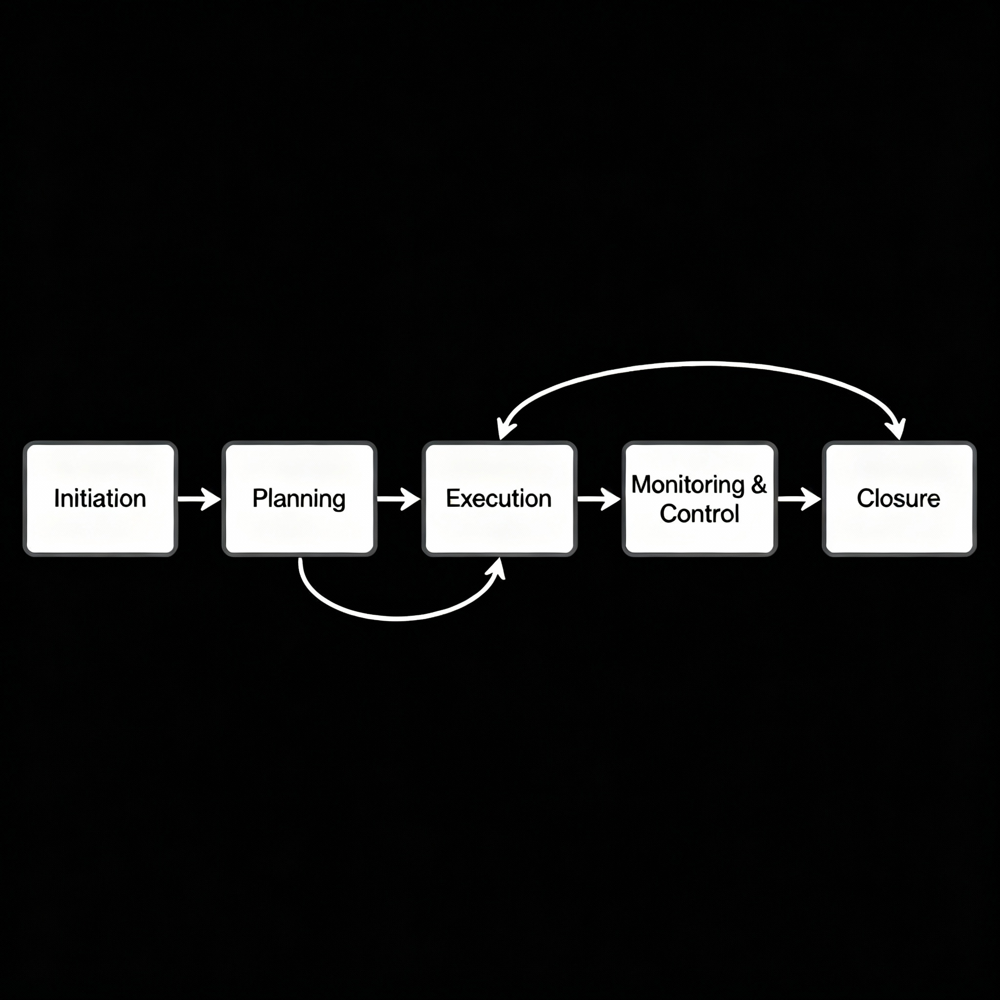
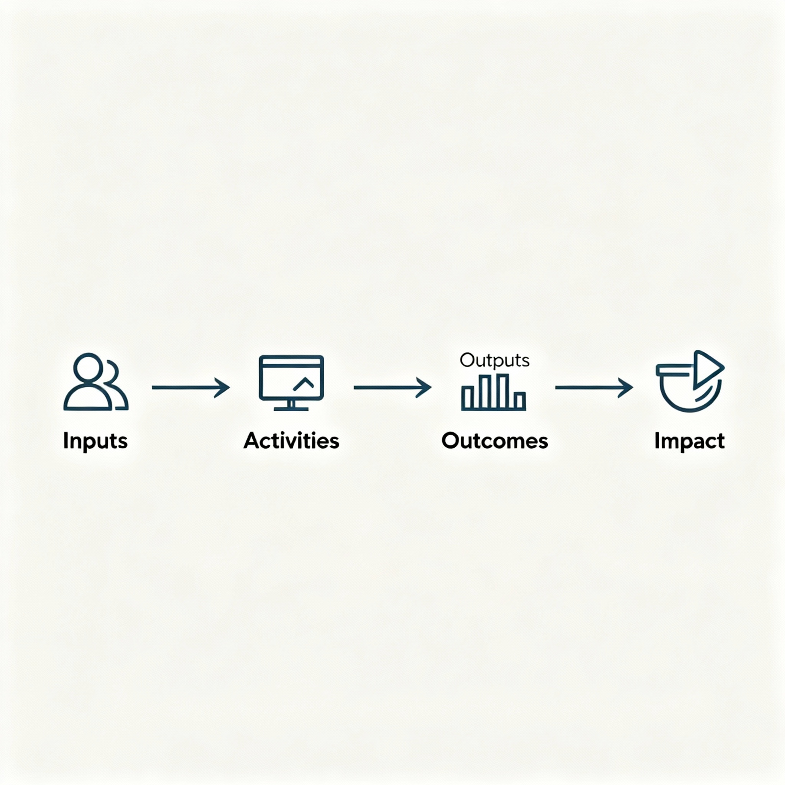
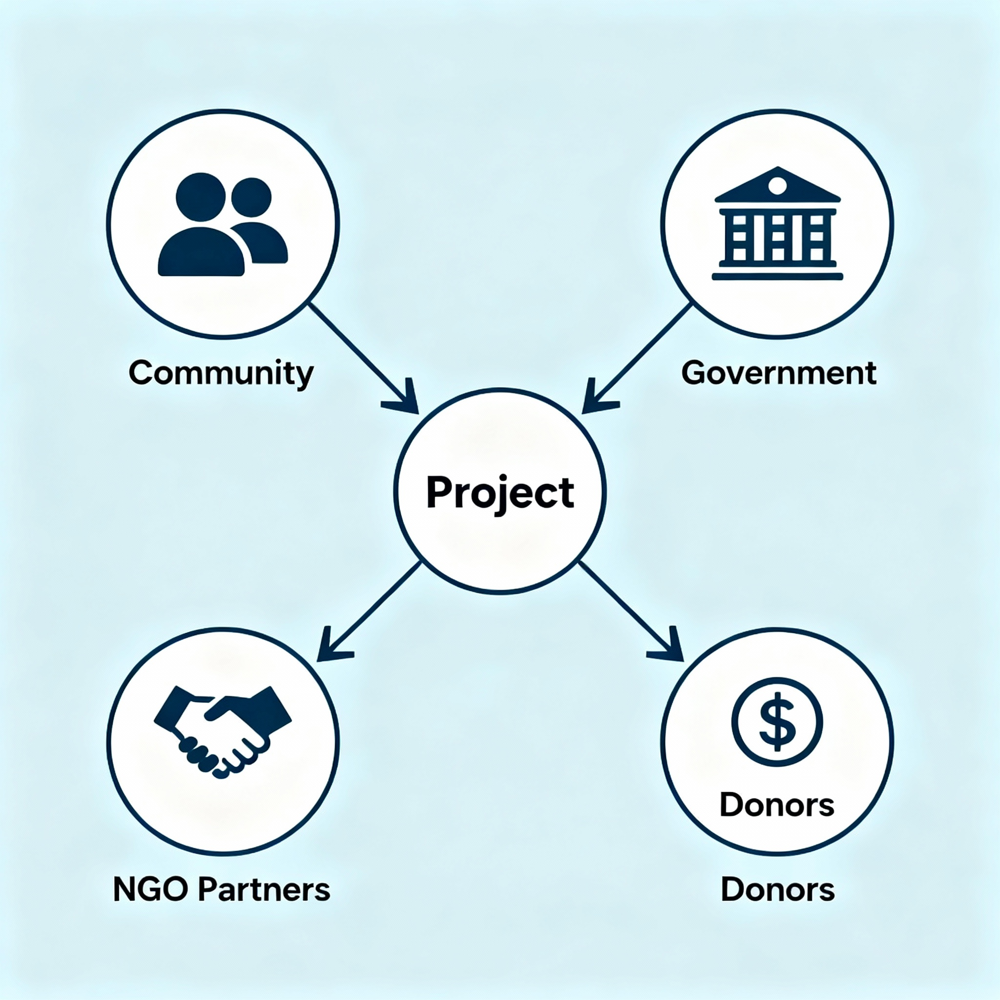

# Chapter 1 – Understanding and Connecting the Dots: Introduction to Social Good, AI, and Projects

## Unit 2: Management of Social Good Projects

### Block 1

Across the world, social good initiatives aim to address complex challenges such as education inequality, health access, environmental protection, and gender inclusion. While these initiatives are driven by strong values and community needs, many struggle to translate good intentions into sustainable impact. Limited funding, diverse stakeholders, cultural sensitivities, and uncertain environments make managing social good projects particularly demanding.

Effective project management provides a structured way to navigate these challenges. By applying clear planning, coordination, and monitoring practices, social initiatives can move from abstract goals to concrete, measurable outcomes that genuinely improve lives.

You will learn how to structure a social good initiative as a project, plan activities, manage time, people, and resources effectively, and adapt plans while staying aligned with social objectives.

Throughout this unit, you will follow the story of Amina Rahman, a local project manager for a small non-profit organization that aims to improve educational opportunities for women who were unable to complete formal schooling. The goal is to enhance education access and literacy rates for the women by addressing barriers that prevent them from attending school. 

Amina is not a corporate project manager with access to advanced software or large teams. Instead, she represents a realistic social good project manager, relying on clear planning, communication, and adaptability to guide the project from idea to implementation.

By following Amina’s decisions and challenges across each project phase, learners will see how project management principles are applied in real-world social contexts.

By the end of this unit, learners will be able to:

- Understand the key phases of the project management lifecycle in social good initiatives

- Apply basic project planning concepts to community-based projects

- Identify the role and responsibilities of a project manager in a social context

- Recognize how flexibility, cultural sensitivity, and stakeholder engagement shape project decisions

- See how a real-world project manager like Amina structures and manages a women’s literacy project

This unit provides a practical foundation for managing social good projects effectively.

## Understanding the Project Journey: From Idea to Impact
### Block 2

**Every successful social good project** follows a similar journey, like building a house or planning a wedding. There are essential steps that ensure success, and understanding this journey helps you manage projects more effectively.

### The Five Phases of Project Management
### Block 3

The phases outlined below provide a clear framework for planning and managing this type of social good project.

**1. Project Initiation: “Getting Started Right”**

In the initiation phase, the goal is to move from recognizing the problem to framing the project solution, by understanding the problem and assess its feasibility. This stage is essential because it sets the foundation for the rest of the project.

When Amina first arrived in the village, she did not begin with lesson plans or schedules. Instead, she began by listening.

She spent time speaking with women in their homes, meeting local leaders, and observing daily routines. What she heard quickly challenged her initial assumptions. Many women wanted to learn to read and write, but childcare responsibilities, seasonal migration for work, and long distances to learning spaces made regular attendance difficult. Some families were supportive, while others were hesitant, unsure whether education would truly benefit the household.

Before committing to the project, Amina asked herself a critical question: Is a women’s literacy program realistic here, and if so, what would it need to look like? She assessed the availability of local volunteers, safe meeting spaces, basic learning materials, and community support. She also met with village elders and women’s group representatives to explain the idea and listen to their concerns.

Together, they defined what success would mean, not in abstract terms, but in practical ones. Success would be measured by how many women completed the program, gained basic reading and writing skills, and felt confident using them in daily life. Only once this shared understanding was in place did Amina feel confident that the project had a strong foundation.

**2. Project Planning: “Mapping Your Route”**

Once the problem is clearly understood and the feasibility checked, it’s time to create a detailed plan for how to achieve the desired outcomes.

With community support secured, Amina moved from ideas to planning.

She broke the ambitious goal of improving women’s literacy into manageable steps: designing a simple curriculum, training local facilitators, organizing learning spaces, and setting up community outreach. Each task was assigned a timeline and linked to the resources available: people, materials, time, and funding.

Planning required careful realism. Amina knew that rigid schedules would fail in a community shaped by agricultural cycles and migration. Instead, she designed flexible class times and a modular curriculum that allowed women to rejoin lessons if they missed sessions. She also identified risks early: attendance might drop during harvest season, facilitators might need additional support, and transportation could become a barrier in remote areas.

By anticipating these challenges, Amina prepared practical solutions, such as mobile learning sessions, shared transport arrangements, and backup facilitators,ensuring the plan could adapt without losing direction.

**3. Project Execution: “Making It Happen”**

Execution is where the project plan comes to life. It’s about implementing the activities and ensuring everything runs smoothly.

When the first literacy sessions began, the project finally moved from paper to practice.

Amina coordinated teacher training, community outreach, and class delivery, ensuring that each part supported the others. She regularly checked in with facilitators, not only to monitor progress but to encourage them and clarify responsibilities. When challenges arose—as they inevitably did—she addressed them quickly, adjusting roles or schedules as needed.

Community engagement became central to execution. Amina met with families to explain the benefits of the program, encouraged husbands and elders to support attendance, and worked with volunteers to arrange childcare during classes. Feedback from participants shaped how lessons were delivered, leading to more interactive and practical learning activities.

Rather than rigidly following the original plan, Amina treated it as a guide—remaining open to change while staying focused on the project’s core purpose.

**4. Project Monitoring and Control: “Staying on Track”**

Monitoring and controlling is critical to ensure the project is on target to meet its goals. It involves regularly assessing progress and making adjustments as needed.

As the program progressed, Amina closely monitored how well it was working.

She tracked **key performance indicators (KPIs)** such as attendance, participation, and learning progress, using simple assessments and facilitator reports. When attendance declined in one village, she didn’t see it as a failure but as a signal. Conversations revealed that seasonal work was pulling women away at certain times, prompting Amina to **adjust** class schedules and reduce session length during those periods.

Regular **communication with stakeholders** (community leaders, facilitators, and partner organizations) helped maintain trust and transparency. Progress updates highlighted both successes and challenges, reinforcing shared responsibility for the project’s outcomes.

Through continuous **feedback and adjustment**, Amina ensured the project stayed aligned with its goals while responding to real-world conditions.

**5. Project Closure: “Finishing Strong”**

The closure phase marks the completion of the project. This phase is critical for ensuring **sustainability** and reflecting on **what has been achieved**.

As the literacy program approached its end, Amina focused on closure: not as an ending, but as a transition.

Final assessments showed that many women had achieved basic literacy and felt more confident using their skills in daily activities. To ensure the impact continued beyond the project’s formal timeline, Amina organized additional training for local women who could continue teaching in the future.

She documented lessons learned (what worked, what didn’t, and what could be improved) so the organization could replicate or adapt the program elsewhere. The project concluded with a community celebration, where participants received certificates, shared their experiences, and were publicly recognized for their commitment.

For Amina, closure was not just about completing tasks. It was about honoring the community’s effort, reinforcing sustainability, and ensuring that the project’s benefits would last long after her role as project manager ended.

## From Problem to Project: The Theory of Change
### Block 4

Theory of Change (ToC) applies to project management by explaining how and why a project’s activities are expected to lead to desired outcomes and impact. In social good projects especially, it acts as the strategic backbone that connects planning, implementation, and evaluation.

### Understanding Theory of Change
### Block 5

**The Basic Logic Chain:**
Your project should follow a logical sequence: "If we do A, then B will happen, which will lead to C, which will create the change we want."

Before Amina could design activities, timelines, or budgets, she needed to answer a more fundamental question: How will this project actually create meaningful change?
This is where the Theory of Change becomes essential in the project initiation phase of social good work.

In social good projects, problems are often complex and deeply rooted in social, cultural, and economic realities. Improving women’s literacy is not just about offering classes—it involves addressing childcare responsibilities, social expectations, access to safe learning spaces, and community attitudes toward women’s education. Without a clear logic linking actions to outcomes, well-intentioned projects risk failing or producing only short-term results.

For Amina, the Theory of Change helped transform a broad social problem into a clear, structured project idea. Through community conversations, she mapped out how specific actions could realistically lead to change. She identified the core problem—low literacy among women—and explored why it existed. From there, she clarified what needed to happen for change to occur.

Amina’s reasoning followed a simple but powerful chain:

If women are offered flexible, locally accessible literacy classes

And if families and community leaders support their participation

Then women can regularly attend and complete the program

Which leads to improved literacy skills and greater confidence

Ultimately contributing to stronger social and economic participation

This cause-and-effect logic became the foundation of the project. It helped Amina decide what to include in the project and what to leave out, ensuring that every activity served a clear purpose. For example, childcare support was included not as an extra feature, but as a necessary condition for success. Similarly, community engagement was treated as a core activity, not a side task.

For Amina, the Theory of Change was not a formal document created for donors—it was a practical thinking tool that guided her decisions from the very beginning. It allowed her to move confidently from concern to action, turning a complex social challenge into a focused project with a clear direction and purpose.

### Components of Theory of Change
### Block 6

**Activities (What You Do)** These are the specific actions your project will take.

**Outputs (What You Produce)** These are the direct products of your activities.

**Outcomes (Changes That Happen)** These are the changes in behavior, knowledge, or conditions.

**Impact (Long-term Change)** This is the ultimate social change you're working toward.

### Testing the Theory of Change
### Block 7

Before moving forward, Amina paused to test her Theory of Change—not on paper alone, but against the reality of the community she was working with.

She began by questioning her assumptions. Are we being realistic? She asked herself whether women truly had time to attend classes, whether families would support their participation, and whether local facilitators could commit over the full duration of the project. These assumptions were not guarantees; they were conditions that needed to hold true for the project to succeed.

Next, Amina examined the logic of the project step by step. She traced the path from activities to impact, asking whether each action genuinely led to the next outcome. Would flexible class schedules really improve attendance? Would regular attendance translate into improved literacy and confidence? Wherever the links felt weak, she revisited the design and adjusted it.

She also looked for gaps. Were there missing factors that could undermine the project? Conversations with participants revealed that childcare was not just a convenience but a necessity. Without addressing it, even the best-designed classes would fail. Recognizing this early helped Amina strengthen the project before implementation began.

Finally, she asked how she would know whether the theory was working. Success could not be assumed—it had to be observed. Amina identified clear signs to watch for, such as consistent attendance, active participation, and women using their new skills outside the classroom. These indicators would later guide monitoring and learning.

By testing the Theory of Change in this way, Amina ensured that her project was not built on hope alone, but on a thoughtful and realistic understanding of how change could happen in the community.

## Understanding Stakeholders: The People Who Matter
### Block 8

**Stakeholders** are all the people and organizations who affect or are affected by your project. Managing relationships with stakeholders is often the key to project success, especially in social good work where community support is essential.

### Types of Stakeholders
### Block 9

As Amina began shaping the literacy project, she quickly realized that success would depend not only on good planning, but on understanding **who was connected to the project and how**. Some people would benefit directly, others would support the work behind the scenes, and a few had the power to influence the project’s success—positively or negatively.

### **Primary Stakeholders: The People the Project Exists For**

At the heart of the project were the women Amina hoped to support. They were the direct beneficiaries—the reason the project existed at all. Their daily realities, responsibilities, and aspirations shaped every decision Amina made.

But the women were not alone. Their families played a crucial role, as support at home often determined whether attendance was possible. Village leaders and respected elders also mattered, as their approval could open doors—or close them. Existing women’s groups and community organizations brought local knowledge and trust, helping the project feel rooted rather than imposed.

For Amina, engaging these primary stakeholders meant listening carefully, earning trust, and ensuring the project reflected community values and needs.

### **Supporting Stakeholders: The People Who Make the Project Possible**

Behind the scenes, many others helped turn the idea into reality. Amina worked closely with facilitators, volunteers, and project staff who delivered classes and supported participants. Partner organizations contributed expertise, such as literacy curricula or training materials, while local education offices helped align the project with national standards.

Funding organizations also played a critical role, providing the financial resources that made the program possible. Community volunteers offered practical support—helping organize sessions, encourage attendance, or arrange learning spaces.

These supporting stakeholders might not attend the classes themselves, but without their contributions, the project could not function.

### **Influencing Stakeholders: The People Who Can Shape the Outcome**

Amina also paid attention to those who could influence the project from the outside. Local media could help raise awareness and build public support, while social media voices could amplify success stories—or criticism. Some individuals or groups questioned whether women’s education should be prioritized, and their resistance had to be managed with sensitivity and dialogue.

Other organizations working in the same area could become partners—or competitors—depending on how relationships were handled. Regulatory bodies and authorities, meanwhile, had the power to approve, delay, or restrict activities if requirements were not met.

By recognizing these influencing stakeholders early, Amina was able to anticipate challenges, communicate proactively, and protect the project from unnecessary obstacles.

Through this process, Amina learned that stakeholder management was not about controlling people—it was about **understanding relationships**. By recognizing who the project served, who supported it, and who could influence it, she strengthened the project’s foundation and increased its chances of creating lasting change.

## **Working Together: Roles and Teams in Social Good Projects**
### Block 11

Successful social good projects are rarely the result of one person’s effort. They depend on teams with diverse skills working together toward a shared purpose. Understanding different roles helps ensure that all essential functions are covered and that collaboration remains effective, especially in complex community settings.

### **Essential Project Roles**

At the center of the project is the **Project Manager**, whose role is to coordinate all activities and keep the project moving in the right direction. This person oversees resources, aligns tasks with objectives, and acts as the main point of communication between stakeholders. On a daily basis, the project manager plans meetings, tracks progress, resolves problems, and balances competing priorities. Success in this role depends not only on organization and leadership, but also on cultural sensitivity and the ability to adapt when plans need to change.

Working closely with the project manager is the **Community Engagement Coordinator**, often described as the bridge between the project and the community. This role focuses on ensuring that the project remains culturally appropriate and responsive to local needs. Daily work includes meeting with community members, facilitating discussions, collecting feedback, and resolving misunderstandings. Trust, patience, and a deep understanding of local customs and language are essential for success in this role.

**Technical Specialists** contribute expert knowledge in specific fields such as education, health, agriculture, or technology. Their responsibility is to ensure the technical quality of project activities, whether by training facilitators, adapting materials, or solving technical challenges as they arise. These specialists must be able to translate complex ideas into simple, practical guidance and adjust their approach to fit the local context.

Supporting all these roles is the **Administrative Coordinator**, who manages the operational backbone of the project. This role includes handling budgets, documentation, logistics, and compliance requirements. While often less visible, strong administrative support is critical for keeping the project organized, accountable, and on schedule. Reliability, accuracy, and clear communication are key success factors.

### **Community-Based Roles**

Beyond the formal project team, community-based roles play a vital part in grounding the project locally.

**Community Champions** are respected individuals who believe in the project and actively promote it. They encourage participation, help address local concerns, and provide honest feedback from the community. Identifying these champions often means observing who people listen to and trust. Supporting them through recognition, training, and regular communication strengthens the project’s local ownership.

In addition, many projects benefit from a **Local Advisory Committee**, a small group of community representatives who provide guidance and oversight. This committee may include traditional leaders, women’s representatives, youth voices, and technical experts. Meeting periodically, they help ensure the project remains culturally appropriate, inclusive, and aligned with community priorities.

### **Developing Effective Project Teams**

Strong teams do not form automatically—they are intentionally built. Clear role definitions help everyone understand their responsibilities and reduce confusion. Regular communication keeps team members aligned and allows problems to be addressed early. Ongoing skill development ensures the team can respond to new challenges, while cultural sensitivity shapes how the team works together and engages with the community. Finally, clear approaches to conflict resolution help maintain trust and cooperation when disagreements arise.

In social good projects, effective teamwork is not just about efficiency—it is about creating an environment where diverse perspectives, local knowledge, and professional expertise come together to support meaningful and lasting change.

## Key Learning Points
### Block 23

• **Social good projects follow a logical journey from initiation through planning, execution, monitoring, and closure**

• **Theory of Change helps you think through how your activities will create the social changes you want to see**

• **Stakeholder management is crucial for social good projects and requires understanding different interests, influences, and engagement strategies**

• **Effective project teams combine professional expertise with community knowledge and cultural sensitivity**

• **Project management is both systematic and flexible, requiring professional standards adapted to community needs and cultural contexts**

• **Success in social good project management depends on balancing efficiency with relationships, planning with adaptability, and expertise with humility**

---

## Quiz: Management of Social Good Projects

1. **The Theory of Change is most useful for:**
   a) Calculating exact project budgets
   b) Understanding how project activities will lead to desired social changes
   c) Eliminating all project risks
   d) Replacing the need for stakeholder consultation

2. **When managing stakeholders with high influence but low interest in your project, the best strategy is:**
   a) Ignore them since they're not interested
   b) Involve them in all project decisions
   c) Keep them satisfied through occasional updates and respect for their positions
   d) Try to force their participation in all activities

3. **The most important factor for success in social good project management is:**
   a) Using the most advanced project management software
   b) Following all procedures exactly as written in textbooks
   c) Balancing systematic approaches with cultural sensitivity and community engagement
   d) Minimizing all costs regardless of impact on quality

4. **True or False: The project phases (initiation, planning, execution, monitoring, closure) must always follow each other in strict sequence without any overlap.**

5. **AI tools are most helpful for social good project managers when they:**
   a) Replace all human decision-making and community consultation
   b) Are used only by technical specialists
   c) Support systematic planning and documentation while requiring human oversight for cultural appropriateness
   d) Focus only on financial management and budget tracking

**Answer Key:**
   1. b) Understanding how project activities will lead to desired social changes
   2. c) Keep them satisfied through occasional updates and respect for their positions
   3. c) Balancing systematic approaches with cultural sensitivity and community engagement
   4. False
   5. c) Support systematic planning and documentation while requiring human oversight for cultural appropriateness

---

## References

Kerzner, H. (2017). *Project management: A systems approach to planning, scheduling, and controlling* (12th ed.). John Wiley & Sons.

Project Management Institute. (2021). *A guide to the project management body of knowledge (PMBOK guide)* (7th ed). PMI Publications.

Project Management Institute. (2023). *Generative AI overview for project managers*. PMI Resources.

Rogers, E. M. (2003). *Diffusion of innovations* (5th ed.). Free Press.

Theory of Change Community. (2024). *What is theory of change?* Retrieved from https://www.theoryofchange.org/what-is-theory-of-change/

UNDP. (2009). *Handbook on planning, monitoring and evaluating for development results*. United Nations Development Programme.

Weiss, C. H. (1995). Nothing as practical as good theory: Exploring theory-based evaluation for comprehensive community initiatives. In *New approaches to evaluating community initiatives* (pp. 65-92). Aspen Institute.